<h1> cvyl </h1>

> [!IMPORTANT]
> **Development has currently been halted**
> 
> > I am currently working on my education and mental health. I will not be able to work as much on any GitHub projects.
> >
> > You can still contact me via my social media or email if needed.

Hello, I am cvyl! I am an amateur web developer hoping to become a FSD (Full Stack Developer) someday.

I have been working on i18n (internationalization) on many open-source projects and I've started a few projects of my own (in pinned repositories).

I hope to make positive connections with people on the internet. I want to make this world a better place for everyone to live on.
- 🌎 I’m looking to collaborate on **localizing projects**  
  
- 👩‍💻 All of my projects are available [here](https://github.com/cvyl?tab=repositories)  
  
- 📝 I sometimes write articles on [my blog!](https://cvyl.me)  
  
- 📫 How to reach me *cvyl@pm.me*  
  
- ♓ Fun fact **I am a [Pisces](https://en.wikipedia.org/wiki/Pisces_(astrology))!**

  
  

---

 

<picture>
  <source
    srcset="https://github-readme-stats.vercel.app/api?username=cvyl&show_icons=true&theme=dark"
    media="(prefers-color-scheme: dark)"
  />
  <source
    srcset="https://github-readme-stats.vercel.app/api?username=cvyl&show_icons=true"
    media="(prefers-color-scheme: light), (prefers-color-scheme: no-preference)"
  />
  
</picture>

  **Stack**

  
  
  
  
  
  
  
  
  
  
  
  
  **Misc**

  
  
  

  *人生就像一盘西洋棋，我不会下西洋棋。*

<!--

-->
